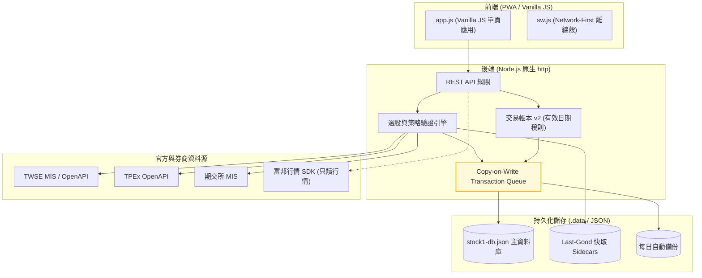

# stock-cockpit

[](https://github.com/kuotunyu/stock-cockpit/actions/workflows/ci.yml)


[](LICENSE)

本專案為無框架 (Framework-less) 實作之台股看盤終端與策略檢驗系統：整合 TWSE、TPEx 與期交所官方資料源，提供隔日沖與波段選股引擎（含收盤資料前向驗證）、技術分析指標、注意/處置股票看板、自選股與精確交易稅則帳本。後端採用單檔 Node.js 原生 `http` 模組 (`server.mjs`)，前端採用 Vanilla JS 單頁架構 (`app.js`)，執行期僅包含富邦行情 SDK 單一外部依賴。

> **免責聲明**：本專案為個人策略研究工具，所有訊號、統計與損益估算僅供參考，不構成任何投資建議或交易要約；實際交易費稅請以證券商對帳單為準。

---

## 系統核心機制

1. **前向驗證成績單 (Forward Validation)**：
   選股訊號每日與官方收盤數據對齊後凍結正式快照；盤中即時計算標示為暫定，確保策略驗證數據不被回溯竄改。
2. **交易帳本 v2 (Tax & Ledger Engine)**：
   商品與交易型態獨立建模，依成交日期自動套用有效日期化證交稅規則，歷史損益凍結後維持不可變性 (Immutability)。
3. **Copy-on-Write 交易佇列與原子落盤**：
   持久化讀寫採用 Copy-on-Write Transaction Queue 進行隔離與寫入租約 (Writer Lease) 互斥，確保 JSON 資料庫落盤安全性。
4. **誠實降級與資料品質警告 (Honest Degradation)**：
   上游 API 異動或單一市場失敗時自動調用 Last-Good 快取，並於回應附帶品質警告標記，絕不以過期數據偽裝為即時行情。

---

## 系統架構



---

## 系統介面

| 隔日沖訊號與前向驗證 | 策略雷達 (波段選股) |
|---|---|
|  |  |

| 技術分析繪圖 | 注意/處置股票看板 |
|---|---|
|  |  |

| 盤中動態篩選 | 手機版介面 (PWA) |
|---|---|
|  |  |

---

## 快速開始

需求：Node.js 20.19+ 或 22+。

### 1. 安裝依賴與啟動服務

```powershell
# 安裝依賴
npm install

# 啟動本機伺服器 (開啟 http://127.0.0.1:5174)
npm start
```

### 2. 執行自動化測試

```powershell
# 執行離線單元測試套件 (無需網路連接)
npm test

# 執行真實上游 API 形狀對齊測試 (選用)
npm run test:live
```

---

## 環境變數與配置說明

```text
NODE_ENV=production
HOST=0.0.0.0
PORT=5174
APP_SECRET=長且隨機之加密密鑰 (用於券商憑證與 API 設定加密)
ADMIN_USERNAME=admin
ADMIN_PASSWORD=強密碼
PUBLIC_ORIGIN=https://你的正式網域
COOKIE_SECURE=true
DATA_DIR=/var/app/data
```
