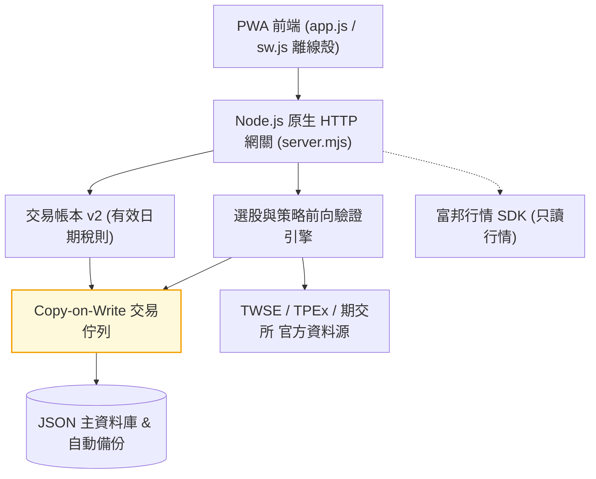
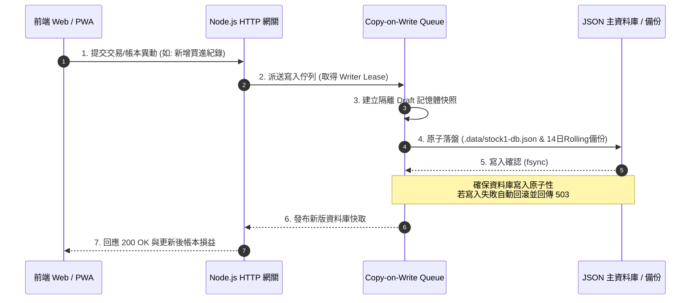

# stock-cockpit

[](https://github.com/kuotunyu/stock-cockpit/actions/workflows/ci.yml)


[](LICENSE)

本專案為無框架 (Framework-less) 實作之台股看盤終端與策略檢驗 Web 系統：整合 TWSE、TPEx 與期交所官方資料源，提供隔日沖與波段選股引擎（含收盤資料前向驗證）、技術分析指標、注意/處置股票看板、自選股與精確交易稅則帳本。後端採用單檔 Node.js 原生 `http` 模組 (`server.mjs`)，前端採用 Vanilla JS 單頁架構 (`app.js`)，執行期僅包含富邦行情 SDK 單一外部依賴。

> **免責聲明**：本專案為個人策略研究工具，所有訊號、統計與損益估算僅供參考，不構成任何投資建議或交易要約；實際交易費稅請以證券商對帳單為準。

---

## 系統介面

### 桌面版看盤終端

| 隔日沖訊號與前向驗證 | 策略雷達 (波段選股) |
|---|---|
|  |  |

| 技術分析繪圖 | 注意/處置股票看板 |
|---|---|
|  |  |

| 盤中動態篩選 |
|---|
|  |

### 行動裝置 PWA 介面

<div align="center">

| PWA 行動裝置即時看盤 (390px 響應式介面) |
|:---:|
|  |

</div>

---

## 系統核心機制

1. **選股訊號每日前向驗證 (Forward Validation)**：
   隔日沖與波段選股訊號每日與官方收盤數據對齊後凍結正式快照，並在之後的交易日以官方日 K 對答案；盤中即時計算結果明確標示為暫定，確保策略檢驗數據不被回溯竄改。凍結由伺服器內建的收盤後排程執行（每 10 分鐘檢查一次，兩市場整批收盤對齊後才跑；`SCHEDULER=off` 可關），伺服器沒開的日子不會有快照。成績單以「開盤賣／收盤賣扣費稅後為正」的可執行勝率為主，附以日為叢集的信賴區間，並依大盤季線上／下分層。
2. **交易帳本 v2 (Tax & Ledger Engine)**：
   商品與交易型態獨立建模，依成交日期自動套用有效日期化證交稅規則（估算值與券商實際值分離），歷史損益一經凍結維護不可變性 (Immutability)。
3. **Copy-on-Write 交易佇列與原子落盤**：
   持久化讀寫採用 Copy-on-Write Transaction Queue 進行隔離與寫入租約 (Writer Lease) 互斥，確保 JSON 資料庫落盤安全性，失敗自動回傳 `503`。
4. **誠實降級與資料品質警告 (Honest Degradation)**：
   官方上游 API 異動或單一市場失敗時自動調用 Last-Good 快取，並於回應附帶品質警告標記 (`warnings` / `dataQuality`)，絕不以過期數據偽裝為即時行情。
5. **全離線測試與 PWA 離線殼**：
   內建離線測試套件 (`node:test` + jsdom，零網路 Mock 上游)，搭配 PWA Network-First 離線殼，API 端點永不強行快取舊行情。

---

## 系統架構與流程

### 系統架構



### 交易佇列與寫入時序



---

## 策略驗證與選股引擎

系統內建兩套獨立策略引擎，均配備官方數據對齊與歷史績效追蹤機制：

| 策略引擎模組 | 選股特徵與演算法 | 驗證機制與對答案邏輯 |
|---|---|---|
| **隔日沖選股引擎 (Overnight)** | 以還原權息後的日 K 分三群：強勢續攻（漲 3～9.5%、量比 ≥1.5、收在高檔、站上 MA5/MA20）、爆量高危（量比 ≥3 且振幅大或收盤轉弱）、回檔轉強；候選池為日量 ≥100 張的普通股依動能取前 260 檔。注意／處置與法人資料只做標示，不進判定 | 伺服器排程在兩市場整批收盤對齊後凍結快照，之後以官方認定的實際下一交易日對答案；成績單以開盤賣／收盤賣的淨報酬勝率為主，附以日為叢集的信賴區間與大盤季線上／下分層 |
| **波段選股雷達 (Swing Strategy)** | 全市場日量 ≥500 張的普通股取前 240 檔，掃兩種型態：中軌攻防（貼布林中軌 ≤1σ、站穩 ≥3 天、MACD 金叉 ≥2 天）與上軌續攻（距中軌 1.3～3σ、均線多頭、量比不萎縮）；每檔附進場（當日收盤）、結構停損、目標與扣費稅後的淨盈虧比（≥1 才上榜），價位都套台股升降單位 | 當日凍結、不接受自訂參數；驗證單以官方日 K 逐日推進（開盤價優先、雙觸保守記停損、跌停鎖死順延出場、除權息停等），勝率累積 20 筆結案才顯示，並回報 PF／中位數／最長連虧與處置股另計 |
| **注意/處置股票看板** | 官方公告之注意、處置（含 5／20 分盤間隔）、全額交割、鉅額與即將出關六類 | 以本機每日快照比對「新進／連 N 天／出關」，比不了時明講判定中而非印 0 |

---

## 交易帳本 v2 稅則與損益試算

交易帳本引擎將商品與交易型態分開建模，並具備完整之台股費稅稽核機制：

- **有效日期化稅則**：依成交日期自動帶入台股證交稅率（普通股 `0.3%`、現股當沖 `0.15%`）。
- **券商手續費折讓**：支援手續費預設 `0.1425%` 與個自訂折扣設定（如 2.8 折、6 折）。
- **估算與實際值隔離**：將預估損益與券商實際對帳單分開存儲，歷史已結算筆數一旦凍結即不可變動。

---

## API 規格與模組分類

唯讀端點未登入即可使用；修改個人或共享資料之端點需通過身分驗證。

| 模組分類 | 主要 API 端點 | 功能說明 |
|---|---|---|
| **服務健康** | `GET /api/health`、`GET /api/app-version` | 系統狀態、上游資料品質警告與數據源連線稽核；本機 build commit 與 GitHub 更新比對 |
| **身分驗證** | `/api/auth/*`、`/api/admin/users` | 管理者帳號登入、Session 管理與權限控制 |
| **行情與大盤** | `/api/quotes`、`/api/markets`、`/api/market/breadth`、`/api/technical-analysis` | 即時大盤、三大法人、融資融券與技術分析 K 線；`market/breadth` 回大盤位階（相對 20／60 日均線）、上市櫃漲跌家數、期指基差與未來 7 天的結算／營收／財報截止事件 |
| **選股引擎** | `/api/overnight*`、`/api/swing*` | 隔日沖、波段選股訊號與每日歷史前向驗證成績單 |
| **注意處置** | `/api/surveillance-board` | 官方注意股票、處置股票與全額交割即時看板 |
| **個人帳本** | `/api/watchlists`、`/api/alerts`、`/api/trades` | 自選股、到價提醒、交易帳本與備份匯出復原 |

---

## 快速開始

需求：Node.js 22.13+ 或 24+，**建議 Node 24 LTS**（Node 20 已於 2026-04-30 EOL，不再提供安全更新）。

### 1. 本地啟動

```powershell
git clone https://github.com/kuotunyu/stock-cockpit.git
cd stock-cockpit
npm install
npm start
```

啟動後開 <http://127.0.0.1:5174>。Windows 也可以直接雙擊專案根目錄的 **`start.bat`**（會自動補跑 `npm install` 並開好瀏覽器），把它「傳送到 → 桌面（建立捷徑）」就不用每次開終端機。

**第一次啟動的預設帳號是 `admin` / `admin1234`**（只在資料庫是空的時候種下去）。登入後請到「更多 → 帳號管理」改掉；沒改的話畫面上會一直有提示。只在自己這台電腦上用（預設綁 `127.0.0.1`，外面連不進來）不改也不會有事，但一旦要對外開放就必須先改。

### 2. 更新到最新版

```powershell
git pull
npm install
```

改到後端（`server.mjs`）必須**重新啟動伺服器**（Node 不會熱載）；只改前端的話瀏覽器 **Ctrl+F5** 一次即可。不確定自己是不是舊版，就到「更多 → 版本與更新」看——那裡會顯示這台跑的 commit，並跟 GitHub 上的最新版比對。

### 3. 從手機／平板看盤（同一個 Wi-Fi）

先在 `.env` 設好強度足夠的密碼與密鑰（對外開放時伺服器會強制檢查，沒設就拒絕啟動），再用 LAN 模式啟動：

```powershell
copy .env.example .env
npm run secret
npm run start:lan
```

`npm run secret` 會印一組隨機字串，貼到 `.env` 的 `APP_SECRET=` 後面；`ADMIN_PASSWORD` 也用同樣方式產生（至少 12 字元）。`npm run start:lan` 啟動後會把手機該輸入的網址印出來。第一次啟動時 Windows 防火牆會跳提示，要選「允許存取」。

> LAN 模式是純 http：同一個 Wi-Fi 上的任何裝置都能攔到流量，包括登入密碼與 cookie。只在自己信任的網路（家裡）用；咖啡廳、公司 Wi-Fi 不要開。

> PWA 的「加到主畫面」需要 HTTPS（`localhost` 例外），所以純 http 的區域網路位址只能用瀏覽器開。想要完整 PWA 體驗得自備憑證或走 Tailscale 之類的方案。

### 4. 備份（建議設定一次就好）

```powershell
npm run backup "D:\OneDrive\stock1-backup"
```

`.data/backups/` 的每日還原點**跟主檔在同一顆硬碟**，它防的是「檔案寫壞」，不防「硬碟掛掉或資料夾被誤刪」。這個指令把不可重建的資料複製到你指定的異地位置（雲端同步資料夾、外接硬碟、NAS 都可以），並保留最新 30 份。

最不能重來的不是交易帳本（那還有券商對帳單可對），是**前向驗證紀錄**與**月營收／EPS 的歷史累積**——官方 API 只回最新一期，過去的期數是這個 App 一天一天存下來的。

要自動化就交給 Windows 工作排程器：程式填 `npm`、引數填 `run backup`、起始位置填專案資料夾。

### 5. 執行自動化測試

```powershell
npm test
```

```powershell
npm run test:live
```

`npm test` 是全離線的（上游全部 mock）；`test:live` 會真的打 TWSE／TPEx，用來偵測官方 API 改版，屬選用。

---

## 環境變數說明

把 `.env.example` 複製成 `.env` 即可，`npm start` 與 `start.bat` 都會自動載入（沒有這個檔就沿用預設值，終端機會印一行 `.env not found`，屬正常）。

```text
NODE_ENV=production
HOST=0.0.0.0
PORT=5174
APP_SECRET=長且隨機之加密密鑰 (用於券商憑證與 API 設定加密，至少 32 字元)
ADMIN_USERNAME=admin
ADMIN_PASSWORD=強密碼 (至少 12 字元)
PUBLIC_ORIGIN=https://你的正式網域
COOKIE_SECURE=true
DATA_DIR=/var/app/data
UPDATE_CHECK=on   # 設 off 可關閉「跟 GitHub 比對版本」的對外查詢
ALLOWED_HOSTS=    # 額外允許的 Host 名稱（逗號分隔）；預設只認 127.0.0.1／localhost 與 LAN 模式列舉的本機位址，其餘回 421
TRUST_PROXY=off   # 只有放在反向代理後面才設 on，代理的 x-forwarded-* 才會被採信
SCHEDULER=on      # 收盤後排程（每 10 分鐘檢查、兩市場對齊後自動掃描與推進驗證）；設 off 回到「有人開 App 才算」
```

伺服器只回應 Host 在允許清單內的請求（其他一律 `421 Misdirected Request`）。這是為了擋 DNS rebinding：瀏覽器裡任何網頁都能把自己的網域指到 127.0.0.1 再打本機 API，Host 是唯一分得出「這是不是你自己開的網址」的線索。

只在自己電腦上跑（綁 `127.0.0.1`）時這些全部可以留空；**一旦綁到非 loopback 位址或設了 `PUBLIC_ORIGIN`，`ADMIN_PASSWORD` 與 `APP_SECRET` 就是啟動的硬性條件**，不足時伺服器會直接拒絕啟動而不是降級執行。
