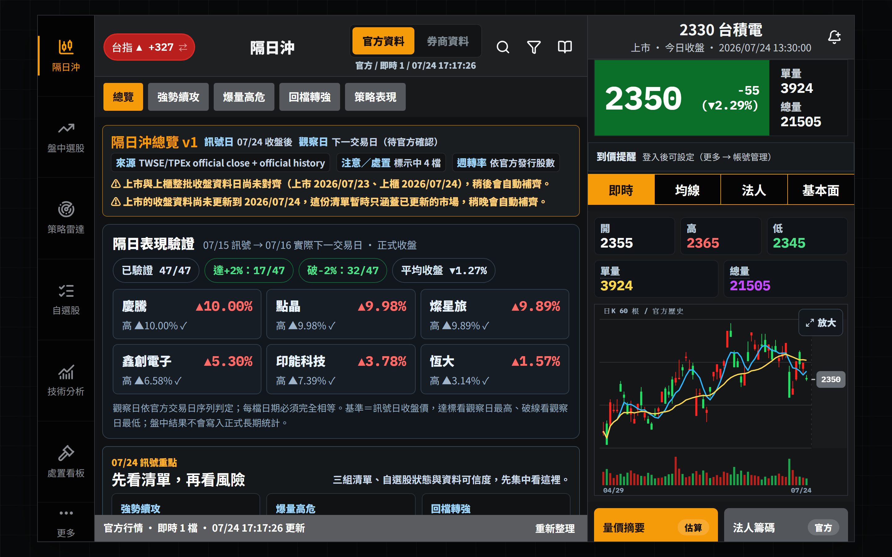
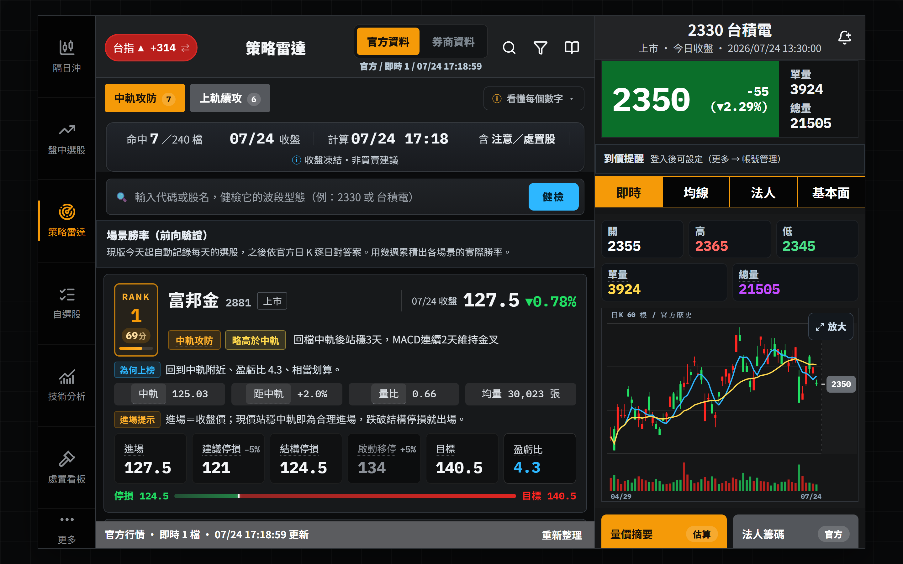
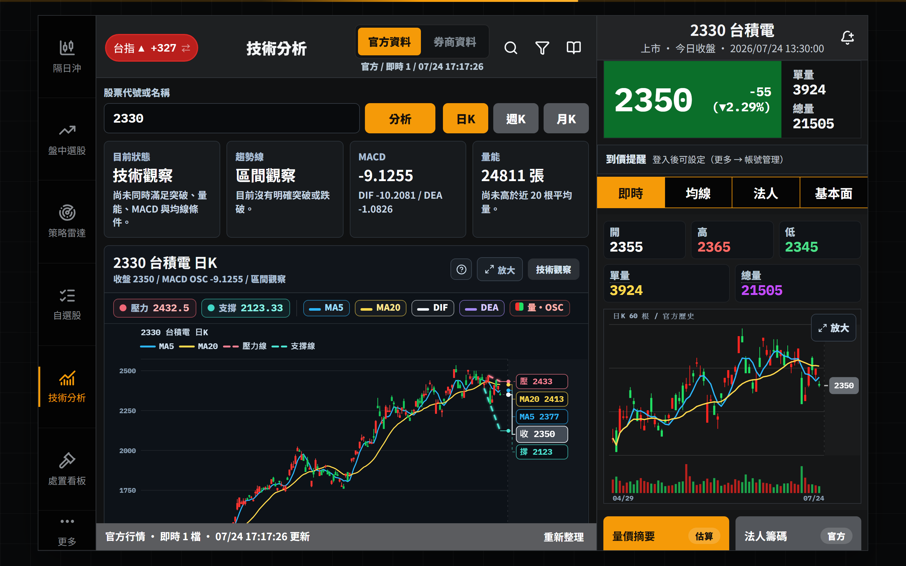
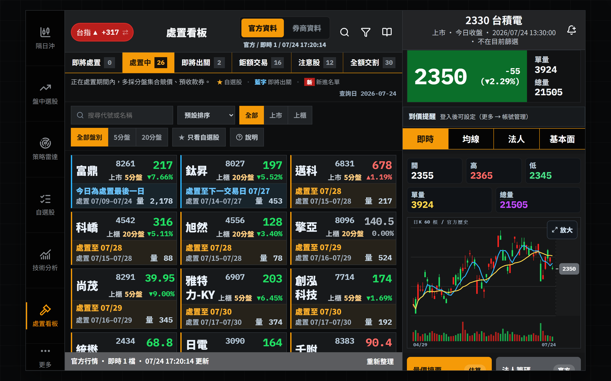
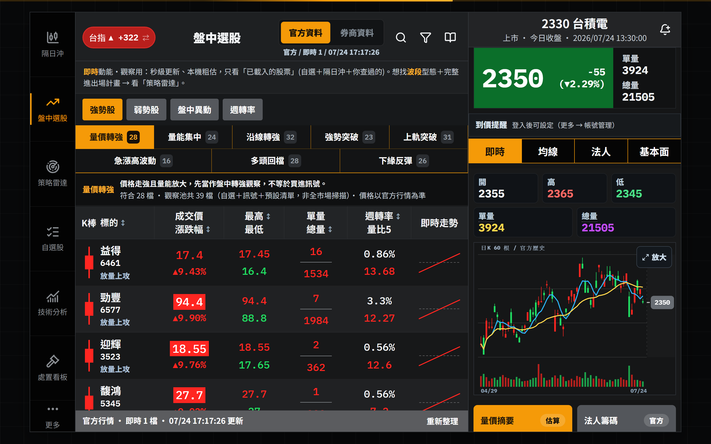
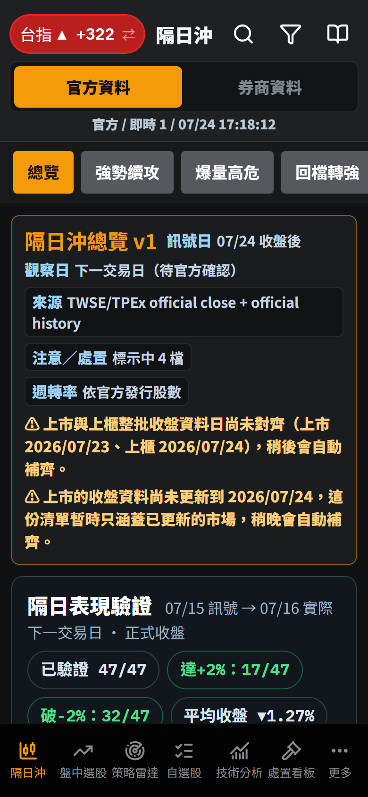
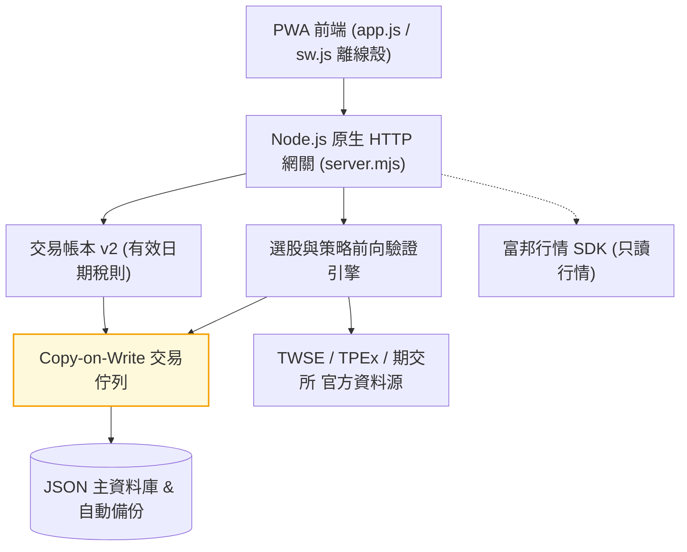

# stock-cockpit

[](https://github.com/kuotunyu/stock-cockpit/actions/workflows/ci.yml)


[](LICENSE)

本專案為無框架 (Framework-less) 實作之台股看盤終端與策略檢驗 Web 系統：整合 TWSE、TPEx 與期交所官方資料源，提供隔日沖與波段選股引擎（含收盤資料前向驗證）、技術分析指標、注意/處置股票看板、自選股與精確交易稅則帳本。後端採用單檔 Node.js 原生 `http` 模組 (`server.mjs`)，前端採用 Vanilla JS 單頁架構 (`app.js`)，執行期僅包含富邦行情 SDK 單一外部依賴。

> **免責聲明**：本專案為個人策略研究工具，所有訊號、統計與損益估算僅供參考，不構成任何投資建議或交易要約；實際交易費稅請以證券商對帳單為準。

---

## 系統介面

| 隔日沖訊號與前向驗證 | 策略雷達 (波段選股) |
|---|---|
|  |  |

| 技術分析繪圖 | 注意/處置股票看板 |
|---|---|
|  |  |

| 盤中動態篩選 | 手機版介面 (PWA) |
|---|---|
|  |  |

---

## 核心技術特性

1. **選股訊號每日前向驗證 (Forward Validation)**：
   隔日沖與波段選股訊號每日與官方收盤數據對齊後自動凍結正式快照；盤中即時計算結果明確標示為暫定，確保策略檢驗數據不被回溯竄改。
2. **交易帳本 v2 (Tax & Ledger Engine)**：
   商品與交易型態獨立建模，依成交日期自動套用有效日期化證交稅規則（估算值與券商實際值分離），歷史損益一經凍結維持不可變性 (Immutability)。
3. **Copy-on-Write 交易佇列與原子落盤**：
   持久化讀寫採用 Copy-on-Write Transaction Queue 進行隔離與寫入租約 (Writer Lease) 互斥，確保 JSON 資料庫落盤安全性，失敗自動回傳 `503`。
4. **誠實降級與資料品質警告 (Honest Degradation)**：
   官方上游 API 異動或單一市場失敗時自動調用 Last-Good 快取，並於回應附帶品質警告標記 (`warnings` / `dataQuality`)，絕不以過期數據偽裝為即時行情。
5. **全離線測試與 PWA 離線殼**：
   內建離線測試套件 (`node:test` + jsdom，零網路 Mock 上游)，搭配 PWA Network-First 離線殼，API 端點永不強行快取舊行情。

---

## 系統架構



---

## API 規格與模組分類

唯讀端點未登入即可使用；修改個人或共享資料之端點需通過身分驗證。

| 模組分類 | 主要 API 端點 | 功能說明 |
|---|---|---|
| **服務健康** | `GET /api/health` | 系統狀態、上游資料品質警告與數據源連線稽核 |
| **身分驗證** | `/api/auth/*`、`/api/admin/users` | 管理者帳號登入、Session Session 管理與權限控制 |
| **行情與大盤** | `/api/quotes`、`/api/markets`、`/api/technical-analysis` | 即時大盤、三大法人、融資融券與技術分析 K 線 |
| **選股引擎** | `/api/overnight*`、`/api/swing*` | 隔日沖、波段選股訊號與每日歷史前向驗證成績單 |
| **注意處置** | `/api/surveillance-board` | 官方注意股票、處置股票與全額交割即時看板 |
| **個人帳本** | `/api/watchlists`、`/api/alerts`、`/api/trades` | 自選股、到價提醒、交易帳本與備份匯出復原 |

---

## 快速開始

需求：Node.js 20.19+、22+ 或 24+。

### 1. 本地啟動

```powershell
# 安裝依賴 (僅 1 項執行期依賴)
npm install

# 啟動本機伺服器 (開啟 http://127.0.0.1:5174)
npm start
```

### 2. 執行自動化測試

```powershell
# 執行離線單元測試套件 (無需網路連接)
npm test

# 執行真實上游 API 形狀對齊測試 (選用)
npm run test:live
```

---

## 環境變數說明

```text
NODE_ENV=production
HOST=0.0.0.0
PORT=5174
APP_SECRET=長且隨機之加密密鑰 (用於券商憑證與 API 設定加密)
ADMIN_USERNAME=admin
ADMIN_PASSWORD=強密碼
PUBLIC_ORIGIN=https://你的正式網域
COOKIE_SECURE=true
DATA_DIR=/var/app/data
```
