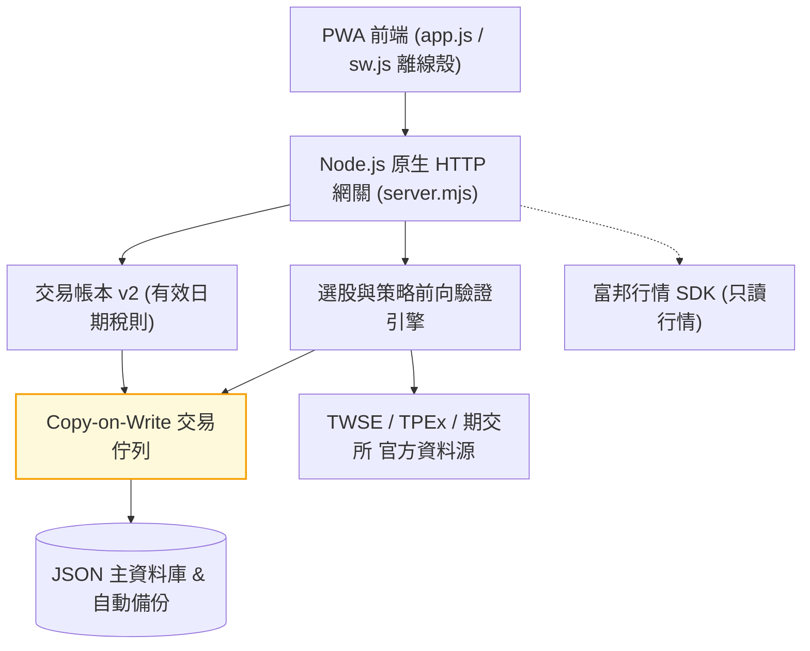
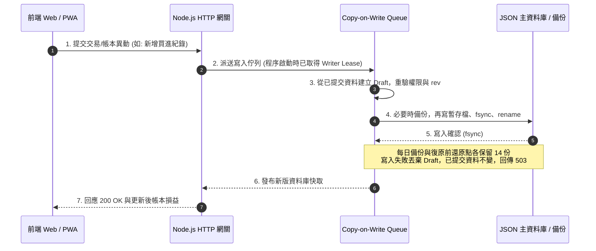

# stock-cockpit

[](https://github.com/kuotunyu/stock-cockpit/actions/workflows/ci.yml)


[](LICENSE)

本專案為無框架 (Framework-less) 實作之台股看盤終端與策略檢驗 Web 系統：整合 TWSE、TPEx 與期交所官方資料源，提供隔日沖與波段選股引擎（含收盤資料前向驗證）、技術分析指標、注意/處置股票看板、自選股與精確交易稅則帳本。後端採用單檔 Node.js 原生 `http` 模組 (`server.mjs`)，前端採用 Vanilla JS 單頁架構 (`app.js`)，執行期僅包含富邦行情 SDK 單一外部依賴。

> **免責聲明**：本專案為個人策略研究工具，所有訊號、統計與損益估算僅供參考，不構成任何投資建議或交易要約；實際交易費稅請以證券商對帳單為準。

---

## 系統介面

以下為 2026-07-24 的介面示意，保留桌面與手機的主要操作配置；畫面中的行情、統計與部分控制項不代表目前版本或即時資料。

### 桌面版看盤終端

| 隔日沖訊號與前向驗證 | 策略雷達 (波段選股) |
|---|---|
|  |  |

| 技術分析繪圖 | 注意/處置股票看板 |
|---|---|
|  |  |

| 盤中動態篩選 |
|---|
|  |

### 行動裝置 PWA 介面

<div align="center">

| PWA 行動裝置即時看盤 (390px 響應式介面) |
|:---:|
|  |

</div>

---

## 系統核心機制

1. **選股訊號每日前向驗證 (Forward Validation)**：
   隔日沖與波段選股在收盤資料完整且兩市場日期對齊後保存正式快照，再以後續交易日的官方日 K 驗證；暫定結果不建立正式驗證紀錄。除了畫面請求，伺服器也每 10 分鐘檢查收盤任務（`SCHEDULER=off` 可關）；伺服器沒開的日子不會自動補建當日訊號。紀錄保存公式版本，成績單區分當前版本、樣本數、資料缺口與大盤位階。各引擎的統計口徑見下表。
2. **交易帳本 v2 (Tax & Ledger Engine)**：
   商品與交易型態獨立建模，依成交日期估算費稅，保留估算、券商、手填與舊資料的來源。既有交易可修正；僅修改預設折數時，不追溯改寫歷史費稅。
3. **Copy-on-Write 交易佇列與原子落盤**：
   持久化讀寫採用 Copy-on-Write Transaction Queue 進行隔離與寫入租約 (Writer Lease) 互斥，確保 JSON 資料庫落盤安全性，失敗自動回傳 `503`。
4. **誠實降級與資料品質警告 (Honest Degradation)**：
   官方上游 API 異動或單一市場失敗時自動調用 Last-Good 快取，並於回應附帶品質警告標記 (`warnings` / `dataQuality`)，絕不以過期數據偽裝為即時行情。
5. **全離線測試與 PWA 離線殼**：
   內建離線測試套件 (`node:test` + jsdom，零網路 Mock 上游)，搭配 PWA Network-First 離線殼，API 端點永不強行快取舊行情。

---

## 系統架構與流程

### 系統架構

| 檔案／目錄 | 責任 |
|---|---|
| `index.html`、`app.js`、`styles.css` | 七個主畫面、前端狀態與渲染、Canvas 圖表、桌面／手機樣式；原生 JS，無打包流程 |
| `server.mjs` | 原生 HTTP API、資料來源、快取、選股與驗證、帳本、帳號、持久化及收盤排程 |
| `sw.js`、`manifest.json`、`icon.svg` | PWA 安裝與離線外殼；API 仍需連線 |
| `lucide.min.js`、`fonts/` | 自架圖示與字型；授權分別保留於程式檔頭及字型目錄 |
| `scripts/`、`start.bat` | 啟動、LAN、密鑰產生、外部備份、覆蓋率與日期體檢 |
| `tests/`、`.github/workflows/` | 離線回歸、上游契約檢查、push／PR 與每日可靠性檢查 |
| `docs/assets/` | README 使用的介面截圖 |
| `.data/`（不進版控） | 主資料庫、備份、基本面累積、風險快取與處置歷史 |



### 交易佇列與寫入時序



---

## 策略驗證與選股引擎

系統內建兩套收盤策略引擎。另有盤中選股與注意／處置看板，各自使用不同資料範圍：

| 策略引擎模組 | 選股特徵與演算法 | 驗證機制與對答案邏輯 |
|---|---|---|
| **隔日沖選股引擎 (Overnight)** | 以還原權息後的日 K 分三群：強勢續攻（漲 3～9.5%、量比 ≥1.5、收在高檔、站上 MA5/MA20）、爆量高危（量比 ≥3 且振幅大或收盤轉弱）、回檔轉強；候選池為日量 ≥100 張的普通股依動能取前 260 檔。注意／處置與法人資料只做標示，不進判定 | 伺服器排程在兩市場整批收盤對齊後凍結快照，之後以官方認定的實際下一交易日對答案；成績單以開盤／收盤價格觀察的淨獲利率為主，附以日為叢集的信賴區間與大盤季線上／下分層 |
| **波段選股雷達 (Swing Strategy)** | 全市場日量 ≥500 張的普通股取前 240 檔，掃中軌攻防與上軌續攻；每檔附進場（當日收盤）、結構停損、目標與扣成本後的淨盈虧比（≥1 才上榜），價位套台股升降單位 | 最多追蹤 15 個實際交易日：開盤價優先，同日雙觸保守記停損，跌停鎖死順延出場。除權息有可用官方基準即調整，未解決或缺日 K 則停等。主比較限訊號日後滿 15 個官方交易日的成熟連續競價觀察，各欄滿 20 筆有效值才顯示比例；淨獲利率與達標率分開，次開觀察與分盤樣本另列 |
| **盤中選股** | 只篩選目前載入的觀察池（自選、搜尋與已載入訊號等）；盤中每 10 秒輪詢更新 | 是本機即時粗估，不是全市場收盤策略或前向驗證 |
| **注意/處置股票看板** | 即將處置、處置中、即將出關、鉅額、注意、全額交割六分頁 | 以本機每日快照比對「新進／連 N 天／出關」，比不了時明講判定中而非印 0 |

隔日沖正式快照與波段驗證單會保留歷史；預設成績單仍分別讀取目前公式最近 260 份快照與近 90 日驗證單。隔日沖四個主要比例各依該欄有效日期計算門檻；未滿 20 日顯示累積進度，全缺顯示未知，達門檻的合法零值顯示 0%。卡片的歷史回測只回看今天入選的股票，有取樣偏誤，應與前向驗證分開解讀。注意／處置股預設保留並標示，可切換隱藏；停牌／下市股不進候選池。

正式發布固定掃描範圍：隔日沖 260 候選／每群 20；波段 240 候選／所有場景／每場景 40。首次完整發布可為零訊號；全部來源失敗或未完成採集不算完整零訊號。UI 場景與顯示筆數不改發布母體，研究參數另存 revision。後到資料、重算與手動 refresh 可以留下更正，但不改原正式 signalId、原計畫與首次發布時間。

API 的 `publication` 提供 captureId、版本身份、輸入指紋、request scope、來源日期精度與本機取得／發布時間；寫入失敗回 `kind: "not-persisted"` 並保留重試提示。正式身份與全部修訂保存在主 DB 的 `verificationPublications`，與訊號／驗證單同次原子提交及備份。來源只有日期時不補造時分秒；週一才取得週五清單，不代表週五已能決策。 發布先原子保存清單與 `publicationStartedAt` 下界，再一次性補存真正可讀後的 `availableConfirmedAt` 上界；`publishedAt`／`decisionAvailableAt` 採此保守上界並標 `confirmed-available-upper-bound`。補證失敗不撤銷正式清單，時間保留 null 與原因；之後讀取時用當下真實時間補證，不能回填。跨開盤的提交區間不能直接認定必定晚發布。

評估 metadata 分為 `selectionVersion`、`evaluationVersion`、`costModelVersion`、`cohortPolicyVersion`、`entryModel`、`returnBasis`（schema 2），另保留 `formulaVersion` 相容。舊價格觀察算式為 `overnight-price-observation-v1`／`swing-price-observation-v1`，成本為固定扣 0.471 個百分點的 `flat-round-trip-0.471pct-v1`，母體政策為 `first-canonical-publication-v1`。這些仍是收盤基準的還原座標價格觀察，並非成交或帳戶含息實績。

成績單的 `modelGroups`／`selectedModelKey` 保留各原觀察模型，主卡使用 `cohort.headline`／`cohort.selectedModelKey` 的正式母體比較，不混算新版與舊版。缺少舊 metadata 標 `legacy-unknown`，未知成本不補算淨值，也不把原始勝負布林當成有效淨獲利率分母或 CI。已有 final 觀察保留；舊訊號補算另存 `observationRevisions`，標記事後觀察與本次實際模型，不能補成當時正式發布。舊波段 pending 的 `evaluationApplied` 只證明本次補驗套用的模型，不回填原始進場或當時可得時間。

新建立的正式訊號採 `overnight-hypothetical-holding-v1`／`swing-hypothetical-holding-v1`，`returnBasis=cash-holding-return`。每筆固定 **1 股假設部位**，建立時保存原始日期、價格、投入與風險金額；這不是使用者實際成交。股利不再投入，公告現金股利以假設應收價值計入，支付只改分類、不重複加收益。產品成本 `initial-notional-flat-0.471pct-v1` 為原始價款 × 0.471%，分母仍為原始價款；未計個人股利稅與補充保費。100 元買 1 股、配息 5 元、104.5 元退出，零成本持有報酬為 9.5%，原價格比例觀察為 10%；套產品成本後含息模型為 9.029%。

新 API 保留 `resultPct`／隔日 `openReturn` 等價格欄位，含息結果另放波段 `holdingOutcome`、隔日 `holdingOutcomes.open/close`。`cohort` 的含息模型淨欄位使用含息結果，淨獲利率按完整 `netPnl > 0`，與報酬率各有分母；`holdingCoverage` 揭露未知與不支援。新股必須有退出前可處分股數和零碎結算證據；現增參與及投入缺證保持未知，有額外投入時只給絕對損益、不編造多時點報酬率。TWSE 月結果與 [TPEx 歷史除權息計算結果](https://www.tpex.org.tw/zh-tw/announce/market/ex/cal.html) 的覆蓋僅限官方除權息；抓取失敗不等於無事件。

已知舊價格模型 pending 仍依原規則續驗；舊 final／identity 不覆寫、不反推原價。次開另維持原價格模型與退出窗口，不產生次開含息收益。已結案或 final 的含息未知結果依當次證據保存，**本版不會自動補算**；原始部位、退出與缺漏原因可供後續明示修訂模型使用，目前可查閱獨立價格觀察。切回價格讀取不能覆寫新事件證據。

「分母、模型與來源」另列 **0／10／25／50 bps 額外成本壓力**：從完整含息淨報酬再扣假設成本，100 bps＝1 個百分點，不重扣基準 0.471% 或退出價內的跳空。例如基準 1%、額外 25 bps 為 0.75%；這是敏感度投影，不改原始價格或成交模型。基準手續費折數為 6 折（乘 0.6），仍未含最低手續費、個人股利稅及補充保費。

事後 **netR＝完整 `netPnl` ÷ 鎖定的原始風險金額**，風險是（原始進場價−當時有效停損價）×原始股數，分母不加成本；950／500＝1.9R。移停、公司行動與重開報表不改它；缺原始風險、風險非正或缺完整損益則未定義，隔日沖未計畫停損不顯示 R 數值。選股卡淨 RR 與部位預算維持原用途。API 的成熟 `cohort.models[].costRisk` 含成本情境與 R 各自有效筆數／缺值原因；隔日分 `open/close`，波段場景、位階與含分盤敏感度沿用原分層。舊價格、次開及未知模型不補造現金 R，不提供策略期望值或帳戶報酬結論。
成績單逐欄提供 `metricCoverage`：`value`、`validCount`、`totalCount`、`missingCount`、`reason` 與有效日期數 `validDays`；合法 0 保留，空值不當 0 或虧損。開盤缺值不借用收盤筆數或日期計算平均、淨獲利率、最低樣本門檻或日叢集 CI。完整零訊號日算採集成功，不進收益 CI；區間仍受日間相依限制，不能視為精度保證。

波段主比較採 `mature-issued-15-official-sessions-v1`：首次正式訊號日之後已滿 15 個官方交易日的同批訊號，無論快速達標、停損或超時，一起到期才納入。日曆使用有界月份的 TWSE FMTQIK 官方日期；不足時成熟狀態未知；若只能證明至少 15 日，成熟可確定但精確 `ageSessions` 為 null。成熟仍可能有缺 K／公司行動待補，平均只代表有效部分的條件式價格觀察。達標率、淨獲利率與歷史平均淨報酬分開；超時淨正也屬淨獲利，分盤撮合另列。隔日沖主比較為 `complete-issued-next-session-v1`，限完整正式下一交易日觀察。模型展開區可查通過各欄門檻的結果、完整模型身份及缺證據原因；既有最長連虧與最差單日保留在原結案口徑，與成熟主比較分開。這些是摘要投影的母體版本，不改寫保存的發布身份。

兩套主卡保留最近結案／逐日觀察，並在「分母、模型與來源」展開區揭露完整紀錄起點、缺覆蓋、模型及原結案口徑。舊 `totals`／`scenarios` API 欄位相容保留並修正缺值分母，不補造歷史 issued。價格觀察不等於含息報酬；兩者都不代表可成交回測或帳戶收益。

單日隔日驗證與歷史成績單同日優先使用首次正式 capture；無正式發布才顯示標示身份的 legacy 觀察，兩者共用完整觀察 memo。已知不支援的波段 evaluation／entry／return 模型保留原證據，以 `evaluationUnavailable` 與摘要 `unavailableCount` 揭露停等，不借用目前算式結案。隔日逐檔 `sourceEvidence` 分開官方成功、確認空資料及失敗，連同備援狀態判定採集完整性；已確認空資料不等於來源故障。

完整枚舉並保留每個候選終端結果後，已有可評估結果的掃描可正式發布並揭露 degraded／coverage；不要求逐檔來源成功率100%。全部候選僅有來源失敗仍不能發布。TWSE STOCK_DAY 已證明的無資料回應（精確中文 stat、numeric total=0、無 data）可確認空月份；超出查詢範圍或未知錯誤不算空資料，這個形狀不外推至 TPEx。

主 DB 的 `verificationCaptures` 與發布共用 captureId、同次提交，保存真正 preselection 當下的候選順位、原價與來源，以及逐檔終端結果和 issued 清單。完整零訊號、未完成、來源失敗與事後發現缺採集分開記錄；候選池不是畫面切片，也不代表全市場。兩套成績單 API 提供 `captureCoverage`／`population`，主卡以 `cohort` 接正式成熟比較，舊欄位保留。`fullRecordStartDate` 只表示完整格式開始日；覆蓋僅以取得的官方交易日與已有正式紀錄核對，後續缺口仍列出。`not-captured` 保存本次發現時間，不能證明當天伺服器一定沒開；舊 capture 沒有候選證據時維持未知。

兩套成績單另提供 `benchmarks`，在「分母、模型與來源」比較「相對候選池的同期間報酬差」。隔日沖使用凍結的官方收盤到次一官方交易日收盤；波段使用訊號後第 1 個官方交易日開盤到第 15 日收盤，與提前停損／達標及含息持有結果分列。兩邊同採官方還原參考價格，各扣 0.471% 近似成本。候選池含入選股，以原凍結名單在各市場等權計算；每市場完整才配對，缺檔不移出原池。`pairedCount/eligibleCount` 是已發布訊號數，候選檔數及有效日期另列；同股跨場景不代表獨立部位，平均報酬不是帳戶資產曲線。收盤發布不證明可用該收盤成交，次開另揭露晚發布與時間不確定。

`verificationBenchmarks` 保存每版完整模型、原 capture/input 指紋、逐檔來源／時間／公司行動與進度，已完成證據不因來源修訂或快取淘汰重算；舊池不回填。成績單先讀已保存進度：隔日視圖最多回傳截至當日最新 260 份正式採集，波段先限制近 90 個日曆日再取最新 260 份，均跨模型選取但按完整模型分組。`benchmarks.window` 明列截止日、實際日期範圍與回傳／可用筆數；窗口外資料仍保留。背景每輪最多一組採集、四檔、三個月，沿用既有月快取與收盤排程續跑；最多 30 次來源呼叫（含逐檔月 K 的一次重試），來源不足保留原因並於 10 分鐘後可再試，不保證短時間補齊所有歷史。指定期間缺 K、官方日曆覆蓋不足、凍結價無法證明官方收盤或與後來月 K 不一致時保持未知，不順延退出日。這套獨立價格觀察不建立同時段指數開盤、含息候選池或完整成交模擬。

官方日曆 v2 保留每月請求起點、取得時間及原始涵蓋上界；跨月前置月份未完整時保持待補，失敗後的舊快取不以本輪時間補蓋完整章。慢請求跨月底以請求起點判定封月，來源時鐘倒退亦不採信。舊版 memo 仍保存但不作 v2 結果，需足夠新證據才完成；既有 24 小時月快取與來源中斷可能延後恢復。明細另顯示原採集模型 identity，跨模型視圖不混淆選股／評估版本。

排程的 `captureStatus` 優先保留首次正式採集，沒有正式清單才讀當日該策略最後的實際嘗試；內容去重的重試另記 `lastAttemptedAt`／`lastAttemptSequence`，不改原採集與發布時間。共用來源尚未齊全另回 `inputStatus`；其失敗或未完成保存為 `strategy: null`／`stage: "reference"`／`canonical: false`，不表示兩策略已開始掃描。只有真的開始且失敗的策略才記採集失敗；驗證推進、尚未開始或已完成的其他策略不受牽連。

新 issued 母體版本為 `first-canonical-issued-manifest-v1`，逐模型滿足 `issued = noEntry + pending + resolved + unresolved`；鎖死與跳空放棄仍保留訊號，缺 K／卡住是 pending 的原因。波段另有 `next-open-price-observation`／`swing-next-open-price-observation-v1`：沿用原收盤觀察的退出事件與窗口，並非獨立交易模擬。提交開始已晚於次一實際交易日開盤才可判晚發布；可讀確認上界在開盤前才可確認時間來得及，跨開盤或未知時間保持 pending。價格觀察值可另列，不能將時間不明的資料算成可進場樣本。過去未記 noEntry 的紀錄不補建新母體。

漏開程式留下的波段 pending 會分批補判：每輪最多 16 組近期與 4 組歷史標的，舊單每次核對停住月份及下一月份的官方交易日、日 K 與公司行動。無法確認市場或來源時保留原因，歷史重試至少間隔 5 分鐘；缺 K 不跳日，來源失敗不冒充已確認缺口。歷史越多，資料檔與備份也會增長，應保留足夠磁碟空間。舊版已刪除、且沒有備份的紀錄無法恢復，不從後來結果反推訊號。新版本累積證據後，不可直接啟動仍會裁剪歷史的舊版；回復前須完整隔離備份並匯出新證據，驗證恢復後再切換。

---

## 交易帳本 v2 稅則與損益試算

交易帳本依買賣時間重放紀錄，以加權平均成本計算持股與已實現損益，並處理股利、配股與現金增資：

- **有效日期化稅則**：依成交日期、商品分類與使用者確認的當沖配對股數估算；分類不明或資格不足會要求覆核。
- **券商手續費折讓**：內建單一預設估算方案，可自訂折數；實際券商或手填費稅（包括 0 元）優先。
- **歷史修正與來源保留**：可新增、修正或刪除交易。經濟內容未變時保留原費稅；修改成交日期、價格、股數等內容時，估算金額由後端重算。
- **目前邊界**：沒有自動當沖配對、先賣後買或多券商帳戶費率引擎；有欄位不代表已自動驗證資格。

---

## API 規格與模組分類

公開行情、訊號與技術分析端點未登入即可使用；個人資料即使只是讀取也需要登入，修改個人或共享資料同樣需要身分驗證。

| 模組分類 | 主要 API 端點 | 功能說明 |
|---|---|---|
| **服務健康** | `GET /api/health`、`GET /api/app-version`、`GET /api/sources` | 依序為啟動就緒／待寫入狀態、版本比對、資料來源狀態 |
| **身分驗證** | `/api/auth/*`、`/api/admin/users` | 管理者帳號登入、Session 管理與權限控制 |
| **行情與大盤** | `/api/symbols`、`/api/quotes`、`/api/markets`、`/api/market-session`、`/api/market/breadth` | 搜尋、報價、市場時段、大盤位階、漲跌家數與事件；期指日盤顯示基差，夜盤另標與現貨收盤之差 |
| **個股資料** | `/api/institutional`、`/api/margin`、`/api/company`、`/api/fundamentals`、`/api/technical-analysis` | 法人、融資融券、公司概況、基本面與 K 線分析 |
| **選股引擎** | `/api/overnight*`、`/api/swing*` | 隔日沖、波段選股訊號與每日歷史前向驗證成績單 |
| **注意處置** | `/api/surveillance-board` | 官方注意股票、處置股票與全額交割即時看板 |
| **個人資料** | `/api/watchlists`、`/api/alerts`、`/api/trades`、`/api/personal-data/*` | 自選股、到價提醒、交易帳本、個人備份匯出與預覽／確認復原 |
| **券商與備註** | `/api/broker/settings`、`/api/broker/test`、`/api/notes`、`/api/notes/recent` | 登入後管理券商行情設定或新增共享備註；近期共享備註可公開讀取 |

---

## 快速開始

建議使用 **Node.js 24.15.0 以上的 24.x 版本**，或 22.22.2 以上的 22.x。這符合目前 jsdom 30 的安裝／測試需求；只執行 App 的最低版本另見 `package.json` 的 `engines`。Node 20 不支援。

### 1. 本地啟動

```powershell
git clone https://github.com/kuotunyu/stock-cockpit.git
cd stock-cockpit
npm install
npm start
```

啟動後開 <http://127.0.0.1:5174>。Windows 也可以直接雙擊專案根目錄的 **`start.bat`**（會自動補跑 `npm install` 並開好瀏覽器），把它「傳送到 → 桌面（建立捷徑）」就不用每次開終端機。

**第一次啟動的預設帳號是 `admin` / `admin1234`**（未指定管理密碼且資料庫為空時建立）。登入後到「更多 → 帳號管理」修改；預設綁 `127.0.0.1`。既有帳號的密碼不會因為修改 `.env` 而自動重設。

### 2. 更新到最新版

```powershell
git pull --ff-only
npm install
```

改到後端（`server.mjs`）必須**重新啟動伺服器**（Node 不會熱載）；只改前端的話瀏覽器 **Ctrl+F5** 一次即可。不確定自己是不是舊版，就到「更多 → 版本與更新」看——那裡會顯示這台跑的 commit，並跟 GitHub 上的最新版比對。

### 3. 從手機／平板看盤（同一個 Wi-Fi）

先在 `.env` 設好強度足夠的密碼與密鑰（對外開放時伺服器會強制檢查，沒設就拒絕啟動），再用 LAN 模式啟動：

若尚未建立 `.env`，先複製範本，保留既有 `.env` 的設定：

```powershell
Copy-Item .env.example .env
npm run secret
```

`npm run secret` 會印一組隨機字串，貼到 `.env` 的 `APP_SECRET=` 後面；`ADMIN_PASSWORD` 也需設定至少 12 字元的強密碼。已有帳號仍須在 App 中修改密碼。停止原本的伺服器並等它完全結束後，再執行：

```powershell
npm run start:lan
```

LAN 啟動會覆寫 `HOST` 為 `0.0.0.0`，並印出手機網址。第一次啟動時 Windows 防火牆可能要求允許存取。

> LAN 模式是純 http：同一個 Wi-Fi 上的任何裝置都能攔到流量，包括登入密碼與 cookie。只在自己信任的網路（家裡）用；咖啡廳、公司 Wi-Fi 不要開。

> PWA 的「加到主畫面」需要 HTTPS（`localhost` 例外），所以純 http 的區域網路位址只能用瀏覽器開。想要完整 PWA 體驗得自備憑證或走 Tailscale 之類的方案。

### 4. 備份（建議設定一次就好）

```powershell
npm run backup "D:\OneDrive\stock1-backup"
```

`.data/backups/` 的每日還原點**跟主檔在同一顆硬碟**，它防的是「檔案寫壞」，不防「硬碟掛掉或資料夾被誤刪」。這個指令把不可重建的資料複製到你指定的異地位置（雲端同步資料夾、外接硬碟、NAS 都可以），並保留最新 30 份。

最不能重來的不是交易帳本（那還有券商對帳單可對），是**前向驗證紀錄**與**月營收／EPS 的歷史累積**——官方 API 只回最新一期，過去的期數是這個 App 一天一天存下來的。

要自動化可用 Windows 工作排程器：程式填 `npm.cmd` 的完整路徑，引數填 `run backup "D:\OneDrive\stock1-backup"`，起始位置填專案資料夾。也可在 `.env` 設定 `STOCK1_BACKUP_DIR` 後只傳 `run backup`；第一次執行帶入的目標不會自動記住。

### 5. 執行自動化測試

```powershell
npm test
```

```powershell
npm run test:live
```

`npm test` 全離線且使用獨立暫存資料目錄與臨時埠；`test:live` 會連接官方來源與 Yahoo，檢查欄位形狀。push／PR 執行離線測試，每日另排日期體檢與上游檢查。更多命令、隔離規則與覆蓋率限制見 [測試指南](tests/README.md)。

---

## 環境變數說明

本機設定集中在 [.env.example](.env.example)，不要把實際 `.env` 提交至 GitHub。尚未建立 `.env` 時才複製範本；`npm start`、`start:lan`、`backup` 與 `start.bat` 會載入它。沒有此檔也能按本機預設啟動。

```text
NODE_ENV=development
HOST=127.0.0.1
PORT=5174
APP_SECRET=長且隨機之加密密鑰 (用於券商憑證與 API 設定加密，至少 32 字元)
ADMIN_USERNAME=admin
ADMIN_PASSWORD=強密碼 (至少 12 字元)
PUBLIC_ORIGIN=
COOKIE_SECURE=false
DATA_DIR=.data
UPDATE_CHECK=on   # 設 off 可關閉「跟 GitHub 比對版本」的對外查詢
ALLOWED_HOSTS=    # 額外允許的 Host 名稱（逗號分隔）；預設只認 127.0.0.1／localhost 與 LAN 模式列舉的本機位址，其餘回 421
TRUST_PROXY=off   # off｜on｜cloudflare：只有放在反向代理後面才設；on 取 x-forwarded-* 最右可信跳點，cloudflare 優先 cf-connecting-ip
TRUST_PROXY_HOPS=1 # 可信代理層數（on 模式取 x-forwarded-for 從右數第 N 段；代理是附加不是取代，最左段由客戶端自填）
SCHEDULER=on      # 收盤後排程（每 10 分鐘檢查、兩市場對齊後自動掃描與推進驗證）；設 off 回到「有人開 App 才算」
STOCK1_BACKUP_DIR= # 異地備份目標；也可直接傳給 npm run backup
```

伺服器只回應 Host 在允許清單內的請求（其他一律 `421 Misdirected Request`）。這是為了擋 DNS rebinding：瀏覽器裡任何網頁都能把自己的網域指到 127.0.0.1 再打本機 API，Host 是唯一分得出「這是不是你自己開的網址」的線索。

範本預設為本機 HTTP，資料放在專案的 `.data`。**設定 production、綁非 loopback 位址或設定 `PUBLIC_ORIGIN` 時，`ADMIN_PASSWORD` 與 `APP_SECRET` 都必須達到強度要求**，否則拒絕啟動。

若另行部署 HTTPS 服務，再依部署環境設定 `NODE_ENV=production`、`PUBLIC_ORIGIN`、`COOKIE_SECURE=true`、持久資料目錄與可信代理；不要把 HTTPS cookie 設定直接用在純 HTTP LAN。更換啟動方式前先完整停止舊程序，同一資料目錄只能有一個寫入程序。
