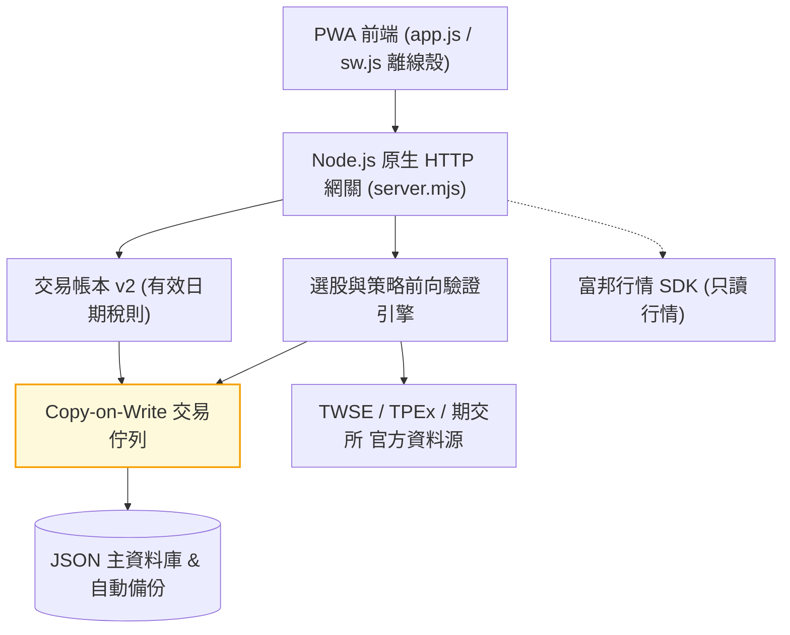
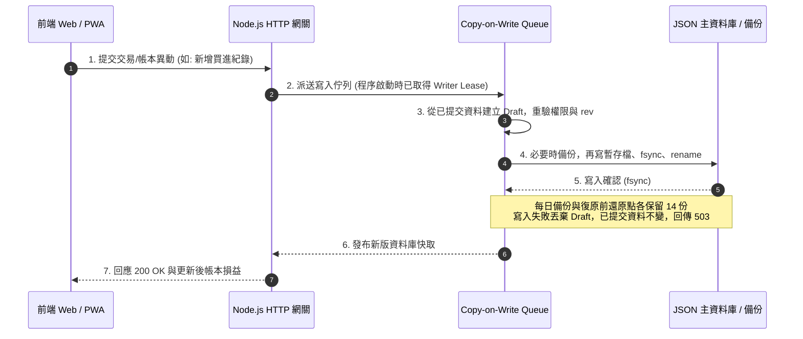

# stock-cockpit

[](https://github.com/kuotunyu/stock-cockpit/actions/workflows/ci.yml)


[](LICENSE)

本專案為無框架 (Framework-less) 實作之台股看盤終端與策略檢驗 Web 系統：整合 TWSE、TPEx 與期交所官方資料源，提供隔日沖與波段選股引擎（含收盤資料前向驗證）、技術分析指標、注意/處置股票看板、自選股與精確交易稅則帳本。後端採用單檔 Node.js 原生 `http` 模組 (`server.mjs`)，前端採用 Vanilla JS 單頁架構 (`app.js`)，執行期僅包含富邦行情 SDK 單一外部依賴。

> **免責聲明**：本專案為個人策略研究工具，所有訊號、統計與損益估算僅供參考，不構成任何投資建議或交易要約；實際交易費稅請以證券商對帳單為準。

---

## 系統介面

以下為 2026-07-24 的介面示意，保留桌面與手機的主要操作配置；畫面中的行情、統計與部分控制項不代表目前版本或即時資料。

### 桌面版看盤終端

| 隔日沖訊號與前向驗證 | 策略雷達 (波段選股) |
|---|---|
|  |  |

| 技術分析繪圖 | 注意/處置股票看板 |
|---|---|
|  |  |

| 盤中動態篩選 |
|---|
|  |

### 行動裝置 PWA 介面

<div align="center">

| PWA 行動裝置即時看盤 (390px 響應式介面) |
|:---:|
|  |

</div>

---

## 系統核心機制

1. **選股訊號每日前向驗證 (Forward Validation)**：
   隔日沖與波段選股在收盤資料完整且兩市場日期對齊後保存正式快照，再以後續交易日的官方日 K 驗證；暫定結果不建立正式驗證紀錄。除了畫面請求，伺服器也每 10 分鐘檢查收盤任務（`SCHEDULER=off` 可關）；伺服器沒開的日子不會自動補建當日訊號。紀錄保存公式版本，成績單區分當前版本、樣本數、資料缺口與大盤位階。各引擎的統計口徑見下表。
2. **交易帳本 v2 (Tax & Ledger Engine)**：
   商品與交易型態獨立建模，依成交日期估算費稅，保留估算、券商、手填與舊資料的來源。費稅欄位留白才使用估算；券商或手填的實際 0 元也是有效值。既有交易可修正；僅修改預設折數時，不追溯改寫歷史費稅。
3. **Copy-on-Write 交易佇列與原子落盤**：
   持久化讀寫採用 Copy-on-Write Transaction Queue 進行隔離與寫入租約 (Writer Lease) 互斥，確保 JSON 資料庫落盤安全性，失敗自動回傳 `503`。
4. **誠實降級與資料品質警告 (Honest Degradation)**：
   官方上游 API 異動或單一市場失敗時自動調用 Last-Good 快取，並於回應附帶品質警告標記 (`warnings` / `dataQuality`)，絕不以過期數據偽裝為即時行情。
5. **全離線測試與 PWA 離線殼**：
   內建離線測試套件 (`node:test` + jsdom，零網路 Mock 上游)，搭配 PWA Network-First 離線殼，API 端點永不強行快取舊行情。

---

## 系統架構與流程

### 系統架構

| 檔案／目錄 | 責任 |
|---|---|
| `index.html`、`app.js`、`styles.css` | 七個主畫面、前端狀態與渲染、Canvas 圖表、桌面／手機樣式；原生 JS，無打包流程 |
| `server.mjs` | 原生 HTTP API、資料來源、快取、選股與驗證、帳本、帳號、持久化及收盤排程 |
| `sw.js`、`manifest.json`、`icon.svg` | PWA 安裝與離線外殼；API 仍需連線 |
| `lucide.min.js`、`fonts/` | 自架圖示與字型；授權分別保留於程式檔頭及字型目錄 |
| `scripts/`、`start.bat` | 啟動、LAN、密鑰產生、外部備份、覆蓋率與日期體檢 |
| `tests/`、`.github/workflows/` | 離線回歸、上游契約檢查、push／PR 與每日可靠性檢查 |
| `docs/assets/` | README 使用的介面截圖 |
| `.data/`（不進版控） | 主資料庫、備份、基本面累積、風險快取與處置歷史 |



### 交易佇列與寫入時序



---

## 策略驗證與選股引擎

系統內建兩套收盤策略引擎。另有盤中選股與注意／處置看板，各自使用不同資料範圍：

| 策略引擎模組 | 選股特徵與演算法 | 驗證機制與對答案邏輯 |
|---|---|---|
| **隔日沖選股引擎 (Overnight)** | 以還原權息後的日 K 分三群：強勢續攻（漲 3～9.5%、量比 ≥1.5、收在高檔、站上 MA5/MA20）、爆量高危（量比 ≥3 且振幅大或收盤轉弱）、回檔轉強；候選池為日量 ≥100 張的普通股依動能取前 260 檔。注意／處置與法人資料只做標示，不進判定 | 伺服器排程在兩市場整批收盤對齊後凍結快照，之後以官方認定的實際下一交易日對答案；成績單按模型分開開盤／收盤價格觀察與假設含息損益，主卡採有效日分母，附以日為叢集的信賴區間與大盤季線上／下分層 |
| **波段選股雷達 (Swing Strategy)** | 全市場日量 ≥500 張的普通股取前 240 檔，掃中軌攻防與上軌續攻；每檔附進場（當日收盤）、結構停損、目標與扣成本後的淨盈虧比（≥1 才上榜），價位套台股升降單位 | 最多追蹤 15 個實際交易日：開盤價優先，同日雙觸保守記停損，跌停鎖死順延出場。除權息有可用官方基準即調整，未解決或缺日 K 則停等。主比較限訊號日後滿 15 個官方交易日的成熟連續競價觀察，各欄滿 20 筆有效值才顯示比例；淨獲利率與達標率分開，次開觀察與分盤樣本另列 |
| **盤中選股** | 只篩選目前載入的觀察池（自選、搜尋與已載入訊號等）；盤中每 10 秒輪詢更新 | 是本機即時粗估，不是全市場收盤策略或前向驗證 |
| **注意/處置股票看板** | 即將處置、處置中、即將出關、鉅額、注意、全額交割六分頁 | 以本機每日快照比對「新進／連 N 天／出關」，比不了時明講判定中而非印 0 |

隔日沖正式快照與波段驗證單會保留歷史；預設成績單仍分別讀取目前公式最近 260 份快照與近 90 日驗證單。隔日沖四個主要比例各依該欄有效日期計算門檻；未滿 20 日顯示累積進度，全缺顯示未知，達門檻的合法零值顯示 0%。卡片的歷史回測只回看今天入選的股票，有取樣偏誤，應與前向驗證分開解讀。注意／處置股預設保留並標示，可切換隱藏；停牌／下市股不進候選池。

成績單裡的「20」不是通用門檻。波段主比較先等訊號日後滿 15 個官方交易日，已結案但未成熟的觀察仍不進成熟母體；淨獲利率、達標率及平均淨報酬再各看自己的有效欄位，兩種比例須滿 20 筆有效樣本才顯示。信賴區間則另需該欄至少 20 個不同有效日期。成熟觀察若缺少該欄資料仍顯示未知，不能借用其他欄的筆數或日期。

正式發布固定掃描範圍：隔日沖 260 候選／每群 20；波段 240 候選／所有場景／每場景 40。首次完整發布可為零訊號；全部來源失敗或未完成採集不算完整零訊號。UI 場景與顯示筆數不改發布母體，研究參數另存 revision。後到資料、重算與手動 refresh 可以留下更正，但不改原正式 signalId、原計畫與首次發布時間。

新版正式訊號採每筆 1 股的假設含息持有，明列股利應收、已收、公司行動覆蓋與近似成本；舊價格觀察按原模型分列。完整含息損益、0／10／25／50 bps 額外成本情境及 netR 各有有效分母，未知不補成 0。這些觀察都不是可成交回測、個人實際損益或帳戶資產曲線。

「分母、模型與來源」可展開採集完整度、正式 issued 四種狀態、各模型與同期間凍結候選池比較。波段候選池基準固定第 1 日開盤到第 15 日收盤，與提前停損／達標及含息結果分開。來源不足保留 pending，補驗不跳過缺少證據的交易日，既有 final 證據不自動改寫。

新完成的候選池 benchmark memo 以無損壓縮保存重複證據，摘要仍直接讀已完成結果；候選清單、來源、原始觀察與模型不裁剪。舊 raw memo 不自動轉換，歷史及備份仍會增長。完整契約、欄位、更新限制見[驗證模型與證據保存](docs/verification.md)，離線量測方式見[測試指南](tests/README.md)。

## 交易帳本 v2 稅則與損益試算

交易帳本依買賣時間重放紀錄，以加權平均成本計算持股與已實現損益，並處理股利、配股與現金增資：

- **有效日期化稅則**：依成交日期、商品分類與使用者確認的當沖配對股數估算；分類不明或資格不足會要求覆核。
- **券商手續費折讓**：內建單一預設估算方案，可自訂折數；實際券商或手填費稅（包括 0 元）優先。
- **歷史修正與來源保留**：可新增、修正或刪除交易。經濟內容未變時保留原費稅；修改成交日期、價格、股數等內容時，估算金額由後端重算。
- **目前邊界**：沒有自動當沖配對、先賣後買或多券商帳戶費率引擎；有欄位不代表已自動驗證資格。

---

## API 規格與模組分類

公開行情、訊號與技術分析端點未登入即可使用；個人資料即使只是讀取也需要登入，修改個人或共享資料同樣需要身分驗證。

| 模組分類 | 主要 API 端點 | 功能說明 |
|---|---|---|
| **服務健康** | `GET /api/health`、`GET /api/app-version`、`GET /api/sources` | 依序為啟動就緒／待寫入狀態、版本比對、資料來源狀態 |
| **身分驗證** | `/api/auth/*`、`/api/admin/users` | 管理者帳號登入、Session 管理與權限控制 |
| **行情與大盤** | `/api/symbols`、`/api/quotes`、`/api/markets`、`/api/market-session`、`/api/market/breadth` | 搜尋、報價、市場時段、大盤位階、漲跌家數與事件；期指日盤顯示基差，夜盤另標與現貨收盤之差 |
| **個股資料** | `/api/institutional`、`/api/margin`、`/api/company`、`/api/fundamentals`、`/api/technical-analysis` | 法人、融資融券、公司概況、基本面與 K 線分析 |
| **選股引擎** | `/api/overnight*`、`/api/swing*` | 隔日沖、波段選股訊號與每日歷史前向驗證成績單 |
| **注意處置** | `/api/surveillance-board` | 官方注意股票、處置股票與全額交割即時看板 |
| **個人資料** | `/api/watchlists`、`/api/alerts`、`/api/trades`、`/api/trade-plans`、`/api/personal-data/*` | 自選股、到價提醒、交易帳本、個人交易計畫、個人備份匯出與預覽／確認復原 |
| **券商與備註** | `/api/broker/settings`、`/api/broker/test`、`/api/notes`、`/api/notes/recent` | 登入後管理券商行情設定或新增共享備註；近期共享備註可公開讀取 |

---

## 快速開始

建議使用 **Node.js 24.15.0 以上的 24.x 版本**，或 22.22.2 以上的 22.x。這符合目前 jsdom 30 的安裝／測試需求；只執行 App 的最低版本另見 `package.json` 的 `engines`。Node 20 不支援。

### 1. 本地啟動

```powershell
git clone https://github.com/kuotunyu/stock-cockpit.git
cd stock-cockpit
npm install
npm start
```

啟動後開 <http://127.0.0.1:5174>。Windows 也可以直接雙擊專案根目錄的 **`start.bat`**（會自動補跑 `npm install` 並開好瀏覽器），把它「傳送到 → 桌面（建立捷徑）」就不用每次開終端機。

**第一次啟動的預設帳號是 `admin` / `admin1234`**（未指定管理密碼且資料庫為空時建立）。登入後到「更多 → 帳號管理」修改；預設綁 `127.0.0.1`。既有帳號的密碼不會因為修改 `.env` 而自動重設。

### 2. 更新到最新版

```powershell
git pull --ff-only
npm install
```

改到後端（`server.mjs`）必須**重新啟動伺服器**（Node 不會熱載）；只改前端的話瀏覽器 **Ctrl+F5** 一次即可。不確定自己是不是舊版，就到「更多 → 版本與更新」看——那裡會顯示這台跑的 commit，並跟 GitHub 上的最新版比對。

### 3. 從手機／平板看盤（同一個 Wi-Fi）

先在 `.env` 設好強度足夠的密碼與密鑰（對外開放時伺服器會強制檢查，沒設就拒絕啟動），再用 LAN 模式啟動：

若尚未建立 `.env`，先複製範本，保留既有 `.env` 的設定：

```powershell
Copy-Item .env.example .env
npm run secret
```

`npm run secret` 會印一組隨機字串，貼到 `.env` 的 `APP_SECRET=` 後面；`ADMIN_PASSWORD` 也需設定至少 12 字元的強密碼。已有帳號仍須在 App 中修改密碼。停止原本的伺服器並等它完全結束後，再執行：

```powershell
npm run start:lan
```

LAN 啟動會覆寫 `HOST` 為 `0.0.0.0`，並印出手機網址。第一次啟動時 Windows 防火牆可能要求允許存取。

> LAN 模式是純 http：同一個 Wi-Fi 上的任何裝置都能攔到流量，包括登入密碼與 cookie。只在自己信任的網路（家裡）用；咖啡廳、公司 Wi-Fi 不要開。

> PWA 的「加到主畫面」需要 HTTPS（`localhost` 例外），所以純 http 的區域網路位址只能用瀏覽器開。想要完整 PWA 體驗得自備憑證或走 Tailscale 之類的方案。

### 4. 整機異地備份與停止服務後還原

「更多 → 個人資料備份」匯出本人資料，適合帳號搬移；以下 CLI 是整機備份，包含所有帳號、帳本、計畫、正式發布 identity、pending／final 前向證據，以及基本面與處置歷史。每日 `.data/backups/` 與主檔在同一顆硬碟，只能防部分檔案損壞；異地包請放雲端同步資料夾、外接硬碟或 NAS。

先停止原 Stock1 服務，等程序完整結束，再以**相同工作目錄與 DATA_DIR／DB_PATH 設定**執行：

```powershell
npm run backup "D:\OneDrive\stock1-backup"
```

`npm run backup` 載入 `.env`；命令列目標優先於 `STOCK1_BACKUP_DIR`，不會自動記住。直接 `node scripts/backup.mjs` 時，DATA_DIR／DB_PATH 必須由環境提供（僅 APP_SECRET 保留讀 `.env` 的備援）。自訂 DB_PATH 必須在 canonical DATA_DIR 內且父目錄已存在；CLI 會顯示實際解析路徑。包內 `stock1-db.json` 永遠是該現役主檔，不能憑包內檔名推定原主檔路徑。

備份全程持有與 server 相同的 writer leases；服務仍在執行或備份中重啟服務會明確拒絕。這是**停止寫入後的一致備份**，不提供熱備份。每次先寫入唯一 `.stock1-backup-incomplete-*` 暫存目錄，JSON、長度、SHA-256 與 manifest 全部核對後，才 rename 發布 `stock1-backup-日期時間-UUID` 成功包。失敗不覆寫或輪替舊包；只輪替已驗證的新格式成功包，保留最新 30 份；與現役 canonical DATA_DIR 重疊的目錄永遠排除，不計入這 30 份。異常中断殘留的 incomplete 目錄不是成功包。

`manifest.json` 記錄格式版本、時間、stopped-writer 一致性、檔案清單與 hash、是否剝除券商憑證，不記錄密鑰或來源私密路徑。弱／未設定 APP_SECRET 時移除券商憑證；強密鑰時保留加密內容，**APP_SECRET 與券商憑證檔須另行安全保管**，不在此包內。風險 last-good 快取與同地 backups 不收錄；基本面歷史不可重建，必須保留。

還原流程：

1. 停止原服務，等程序完整結束；保留原 DATA_DIR 與設定作為回復點。
2. 驗證選中的完整包：`node scripts/backup.mjs --verify "D:\OneDrive\stock1-backup\選中的成功包"`。驗證失敗先中止。舊 `stock1-backup-YYYYMMDD-HHMM` 包仍可辨識和讀取，但只有 JSON 解析檢查，沒有跨檔一致性或雜湊保證，須人工確認來源；它們不會自動輪替。
3. 建立全新隔離 DATA_DIR，複製包內 `stock1-db.json` 至選定的新 DB_PATH；其他 JSON sidecar 依原檔名放在新 DATA_DIR 根目錄。若包未包含可選 sidecar，不從其他包補入。DB_PATH 父目錄先建立；manifest 留在備份包供核對。
4. 使用新 DATA_DIR／DB_PATH、獨立測試埠（例如 `PORT=0`）及 `SCHEDULER=off` 啟動驗證，確認帳本、計畫、正式發布、pending／final 與基本面累積；券商連線需另還原密鑰／憑證檔，弱密鑰包則重新設定。
5. 驗證完成後先停止驗證服務，再切換正式設定並啟動。不要將檔案覆蓋到仍運作的服務目錄。需要回復時，同樣先停止新服務，再切回保留的原資料與設定。

工作排程器也必須安排在服務已停止的時段；程式填 `npm.cmd` 完整路徑，引數填 `run backup "D:\OneDrive\stock1-backup"`，起始位置填專案資料夾。不要把失敗重跑當成熱備份。

### 個人交易計畫與可攜備份

個股明細的「建立我的計畫」可保存隔日沖或波段意圖；自選股頁的「我的交易計畫」可查看與修改。同一股票可有多個計畫。從卡片帶入時，只連結當時顯示且已保存的訊號；來源無法確認時明示為手動計畫。到價提醒仍可獨立使用，不會被當成停損。

首次草稿保留原始內容，首次啟用另凍結完整進場價、停損與股數。之後上移停損可高於原進場價，原風險基準不改寫。進場區間、風險預算及失效條件可另填；計畫價差風險不等於實際成交的 R 分母。結案或取消後不能重開。未送出的草稿僅留在目前頁面記憶體、按帳號隔離；輪詢、切頁或同頁重新登入可保留，重新整理或關閉頁面則不保留。

`GET /api/trade-plans` 回 `{ok,rev,schemaVersion:1,plans}`；`PUT /api/trade-plans` 帶相同 schema 與 rev。每人最多 1000 個計畫，每個計畫最多 100 次後續修改；不得省略既有計畫來刪除歷史。完整計畫與歷史另有 120 KiB 容量（UTF-8，含匯入標記預留），API 請求上限 128 KiB；這些上限同時適用，不代表最大長度內容都能一次送出。超限會明確拒絕，可由計畫視窗匯出保留全部個人資料；匯出不會自動騰出容量。

「更多 → 個人資料備份」匯出的 v2 格式包含計畫與修改歷史、checksum，不含密碼或其他帳號資料。v2 還原取代計畫，先預覽並建立完整還原點；舊 v1 備份缺少計畫，會保留目前計畫並在預覽說明。匯入時間與來源標示為未驗證，checksum 只檢查完整性，不證明事前決策。舊版程式會拒絕 v2 備份；產生新計畫後，回退程式前須先匯出資料並確認相容讀取，避免資料遺失。

### 5. 執行自動化測試

```powershell
npm test
```

```powershell
npm run test:live
```

`npm test` 全離線且使用獨立暫存資料目錄與臨時埠；`test:live` 會連接官方來源與 Yahoo，檢查欄位形狀。push／PR 執行離線測試，每日另排日期體檢與上游檢查。更多命令、隔離規則與覆蓋率限制見 [測試指南](tests/README.md)。

---

## 環境變數說明

本機設定集中在 [.env.example](.env.example)，不要把實際 `.env` 提交至 GitHub。尚未建立 `.env` 時才複製範本；`npm start`、`start:lan`、`backup` 與 `start.bat` 會載入它。沒有此檔也能按本機預設啟動。

```text
NODE_ENV=development
HOST=127.0.0.1
PORT=5174
APP_SECRET=長且隨機之加密密鑰 (用於券商憑證與 API 設定加密，至少 32 字元)
ADMIN_USERNAME=admin
ADMIN_PASSWORD=強密碼 (至少 12 字元)
PUBLIC_ORIGIN=
COOKIE_SECURE=false
DATA_DIR=.data
UPDATE_CHECK=on   # 設 off 可關閉「跟 GitHub 比對版本」的對外查詢
ALLOWED_HOSTS=    # 額外允許的 Host 名稱（逗號分隔）；預設只認 127.0.0.1／localhost 與 LAN 模式列舉的本機位址，其餘回 421
TRUST_PROXY=off   # off｜on｜cloudflare：只有放在反向代理後面才設；on 取 x-forwarded-* 最右可信跳點，cloudflare 優先 cf-connecting-ip
TRUST_PROXY_HOPS=1 # 可信代理層數（on 模式取 x-forwarded-for 從右數第 N 段；代理是附加不是取代，最左段由客戶端自填）
SCHEDULER=on      # 收盤後排程（每 10 分鐘檢查、兩市場對齊後自動掃描與推進驗證）；設 off 回到「有人開 App 才算」
STOCK1_BACKUP_DIR= # 異地備份目標；也可直接傳給 npm run backup
```

伺服器只回應 Host 在允許清單內的請求（其他一律 `421 Misdirected Request`）。這是為了擋 DNS rebinding：瀏覽器裡任何網頁都能把自己的網域指到 127.0.0.1 再打本機 API，Host 是唯一分得出「這是不是你自己開的網址」的線索。

範本預設為本機 HTTP，資料放在專案的 `.data`。**設定 production、綁非 loopback 位址或設定 `PUBLIC_ORIGIN` 時，`ADMIN_PASSWORD` 與 `APP_SECRET` 都必須達到強度要求**，否則拒絕啟動。

若另行部署 HTTPS 服務，再依部署環境設定 `NODE_ENV=production`、`PUBLIC_ORIGIN`、`COOKIE_SECURE=true`、持久資料目錄與可信代理；不要把 HTTPS cookie 設定直接用在純 HTTP LAN。更換啟動方式前先完整停止舊程序，同一資料目錄只能有一個寫入程序。
